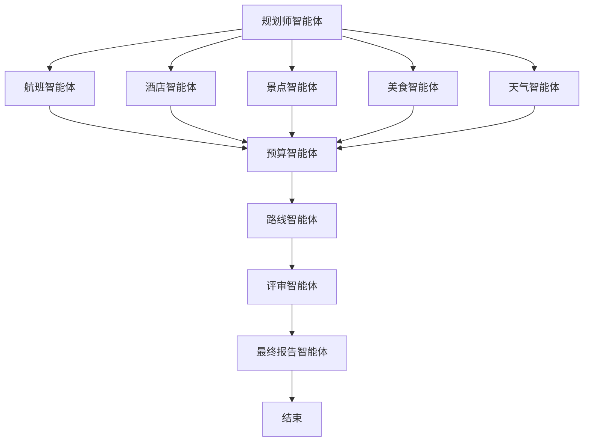

# 多智能体旅行规划系统

基于 Python、FastAPI 和 LangGraph 构建的生产级 AI 旅行助手。系统由 10 个专业智能体协作完成，自动生成完整、优化的旅行行程。

## 功能特性

- **10 个专业智能体**：规划师、航班、酒店、景点、美食、天气、预算、路线优化、评审、最终报告
- **中国本土化数据源**：高德地图（地理编码/路线规划）、和风天气（中文城市天气）、Bing 搜索（中国稳定访问）
- **LangGraph 工作流**：基于图的编排，支持共享状态内存
- **异步执行**：所有智能体异步运行，性能最优
- **三级回退机制**：真实 API → 联网搜索 → Mock 数据，无 Key 也能运行
- **多语言支持**：默认中文输出，支持英文切换
- **流式响应**：通过 Server-Sent Events 实时推送进度
- **缓存与重试**：内置 TTL 缓存和指数退避重试机制
- **结构化输出**：基于 Pydantic 的类型安全状态，输出整洁的 Markdown 报告

## 系统架构



## 项目结构

```
travel-agent/
├── app/
│   ├── agents/          # 10 个专业智能体
│   │   ├── planner.py
│   │   ├── flight_agent.py
│   │   ├── hotel_agent.py
│   │   ├── attraction_agent.py
│   │   ├── food_agent.py
│   │   ├── weather_agent.py
│   │   ├── budget_agent.py
│   │   ├── route_agent.py
│   │   ├── critic_agent.py
│   │   └── final_agent.py
│   ├── tools/           # 外部 API 工具（含中国本土化）
│   │   ├── flight_api.py      # Amadeus 航班 API
│   │   ├── hotel_api.py       # 酒店搜索
│   │   ├── weather_api.py     # OpenWeatherMap
│   │   ├── qweather_api.py    # 和风天气（中国用户首选）
│   │   ├── map_utils.py       # Nominatim 地理编码
│   │   ├── amap_api.py        # 高德地图（中国用户首选）
│   │   ├── directions_api.py  # Google Maps 路线
│   │   ├── web_search.py      # 搜索（Google/Bing/DuckDuckGo）
│   │   ├── web_scraper.py     # 网页抓取
│   │   ├── wikipedia_api.py   # Wikipedia 城市信息
│   │   ├── exchange_api.py    # 汇率转换
│   │   ├── cache_utils.py     # TTL 缓存
│   │   └── retry.py           # HTTP 重试机制
│   ├── graph/           # LangGraph 工作流定义
│   │   └── workflow.py
│   ├── state.py         # 共享状态定义
│   ├── config.py        # 配置管理
│   ├── prompts.py       # 多语言提示词模板
│   ├── llm_client.py    # OpenAI 兼容的 LLM 客户端
│   └── main.py          # FastAPI 服务器
├── tests/               # 单元测试和集成测试
├── requirements.txt
├── .env.example
├── Dockerfile
├── docker-compose.yml
└── README.md
```

## 快速开始

### 1. 安装依赖

```bash
cd travel-agent
pip install -r requirements.txt
```

### 2. 配置环境变量

```bash
cp .env.example .env
# 编辑 .env 填入 API 密钥，或留空使用 Mock 模式
```

### 3. 启动服务

```bash
# 方式 A：直接运行
uvicorn app.main:app --reload

# 方式 B：Docker
docker-compose up --build
```

### 4. 测试 API

```bash
curl -X POST http://localhost:8000/plan \
  -H "Content-Type: application/json" \
  -d '{
    "destination": "Tokyo",
    "days": 5,
    "budget": 2000,
    "preferences": ["food", "culture", "shopping"],
    "origin": "Beijing",
    "language": "zh"
  }'
```

## API 接口

| 接口 | 方法 | 说明 |
|------|------|------|
| `/` | GET | 健康检查 |
| `/health` | GET | 健康检查 |
| `/plan` | POST | 创建旅行计划（同步） |
| `/plan/stream` | POST | 创建旅行计划（SSE 流式） |
| `/workflow/graph` | GET | 获取工作流架构图（Mermaid） |
| `/agents` | GET | 列出所有智能体 |

## 智能体说明

| 智能体 | 职责 |
|--------|------|
| **规划师** | 理解用户需求，分解为子任务 |
| **航班** | 推荐最优航班，兼顾价格和时长 |
| **酒店** | 根据预算和位置推荐酒店 |
| **景点** | 按天和地理位置编排景点 |
| **美食** | 发现地道本地餐厅 |
| **天气** | 提供天气预报和出行建议 |
| **预算** | 计算总费用，检查是否在预算内 |
| **路线** | 优化每日游览顺序，减少交通时间 |
| **评审** | 审查行程质量，提出改进建议 |
| **最终报告** | 整合所有输出为 Markdown 报告 |

## 配置说明

所有设置通过环境变量管理：

| 变量 | 说明 | 默认值 |
|------|------|--------|
| `OPENAI_API_KEY` | OpenAI API 密钥 | - |
| `LLM_MODEL` | LLM 模型名称 | `gpt-4o-mini` |
| `MOCK_MODE` | 使用 Mock 响应（无需 API 密钥） | `false` |
| `DEFAULT_LANGUAGE` | 默认输出语言 | `zh` |

**中国本土化 API（推荐配置）**：

| 变量 | 说明 | 免费额度 |
|------|------|----------|
| `AMAP_KEY` | 高德地图 Web Service Key | 5000 次/天 |
| `QWEATHER_KEY` | 和风天气开发版 Key | 1000 次/天 |
| `BING_SEARCH_API_KEY` | Bing Web Search API Key | 按需付费 |

**国际 API（备用）**：

| 变量 | 说明 |
|------|------|
| `WEATHER_API_KEY` | OpenWeatherMap API Key |
| `GOOGLE_MAPS_API_KEY` | Google Maps Directions API |
| `GOOGLE_SEARCH_API_KEY` | Google Custom Search API |
| `AMADEUS_API_KEY` | Amadeus 航班 API |

**系统配置**：

| 变量 | 说明 | 默认值 |
|------|------|--------|
| `CACHE_ENABLED` | 启用结果缓存 | `true` |
| `CACHE_TTL_SECONDS` | 缓存过期时间（秒） | `3600` |
| `MAX_RETRIES` | HTTP 请求重试次数 | `3` |
| `RETRY_DELAY_SECONDS` | 重试间隔（秒） | `1.0` |

## 测试

```bash
pytest tests/ -v
```

## 技术栈

- **后端**：Python 3.11, FastAPI
- **多智能体框架**：LangGraph
- **LLM**：OpenAI API（可替换）
- **数据校验**：Pydantic
- **测试**：pytest, pytest-asyncio
- **容器化**：Docker, Docker Compose

## 许可证

MIT
